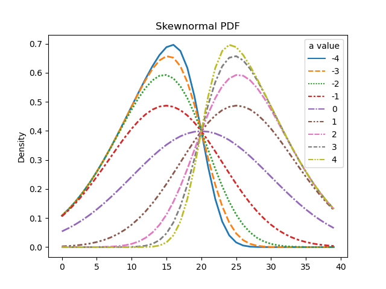
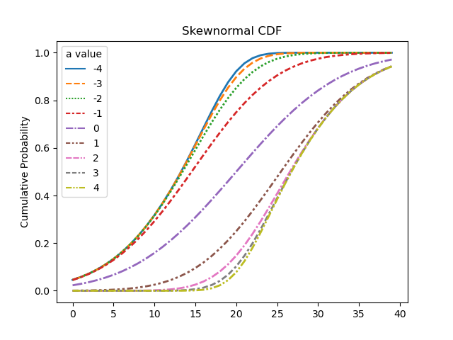

# Skewnormal Curve fitting
Set of routines to fit dose-response data to a skewnormal CDF (cummulative distribution functio0n) curve.
The resultant curve fit produces three parameters:
- *a*:      a measure of distribution skew.
    - a negaive value of **a** will have the distribution skewing to the left
    - a positive va∏lue of **a** will have the distribution skewing to the right 
- *loc*:    parameter specifying the **center** of the distribution (x axis)
- *scale*:  parameter specifying the **spread** of the distribution (x axis)

<!-- 
 -->

## Processing of datasets
Processing of data is in file **skewnormal_dr_curve_fit.py**.  
It is not part of the library itself but retrieves data and calls the library functions.
This calling module
- reads a file from Tox21 dataset and iterates through each molecule endpoint, extracting molecule identificatikon information, dose and response data as well as Hill equation parameters, Hill coefficient and AC50.   

For each molecule:
- the log10 of the response data is taken, scaled between zero and one and then the curve fittling routine is called.  
- if the curve fit is successful the dose response data is plotted, along with the curve fit to the skewnormal CDF and the Hill equation using paraaeters provided in the data file; this file is saved.
    - for the comparison plot the fitted curves (skewnormal CDF and Hill) are reverse scaled so that they can be compared to the unprocessed dose response data.
- all of the extracted information about each molecule, as well as the skewnormal and Hill equation parameters, are put into a dictionary that is exposrted to a JSON file.

## Methods and files
### Processing data
**data_processing.py**
- `retrieve_data_metrics`
- `scale_response`
- `restore_response`
- `hill_eqn`
- `inv_hill_eqn`

### Curve fitting routines
**curve_fit.py**
- `func_skewnorm_cdf`
- `find_skewnorm_curve_parameters`
- `analyze_dose_response`
- `successful_skewnorm_curvefit`

### Distibution plotting routines
**plot_curves.py**
- `plot_skewnorm`
- `plot_skewnorm_curve_fit`
- `plot_hill_eqn`
- `plot_skewnorm_hill`

### Additional modules
**plot_skewnormal.py**
- Plot sample skewnormal curves for documentation purposes

**summarize_hill_vs_sn.py**
- A module that traverses a given directory tree looking for exported JSON files (from previous processing of dose response data) and builds a Dataframe that is used to compare the median values from Hill equation and skewnormal curve fit (AC50 and median_sn) and exports it to a CSV file.
